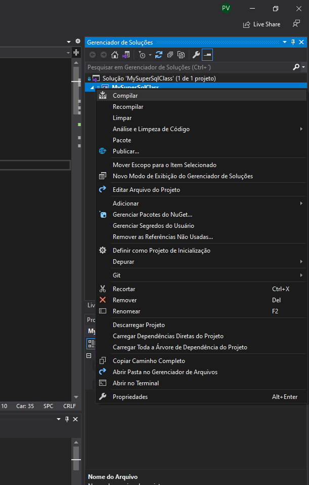
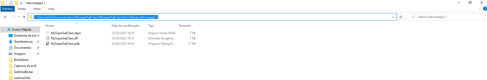
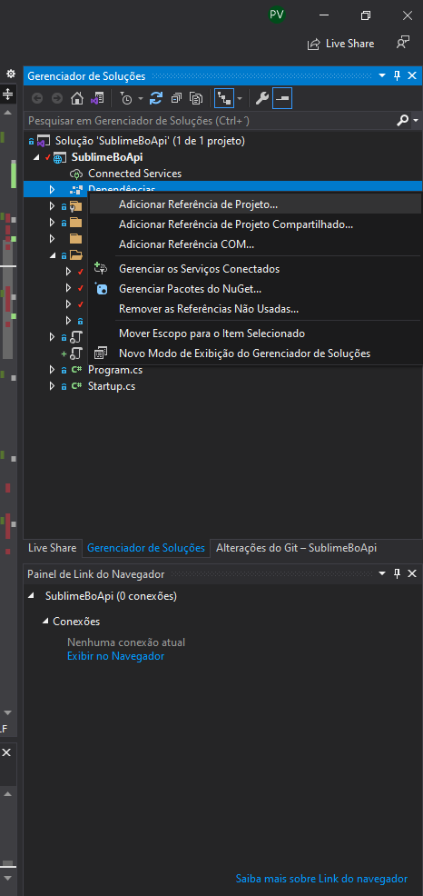
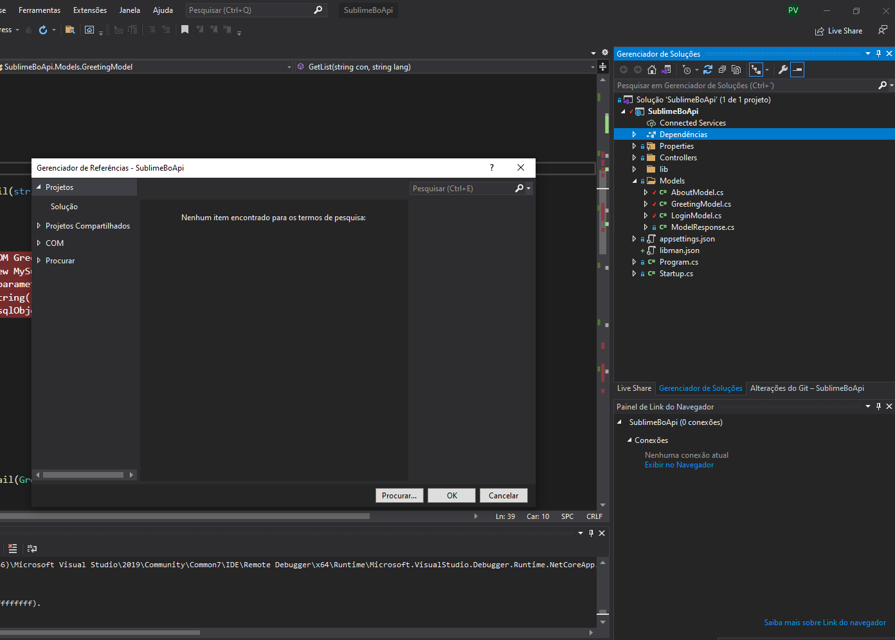
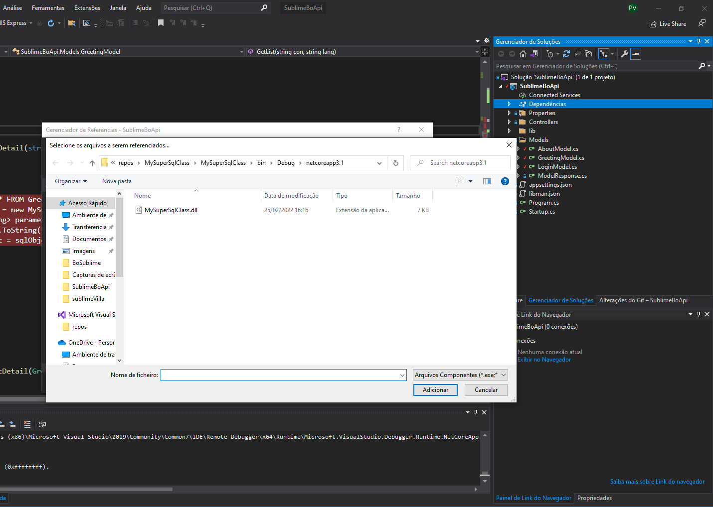
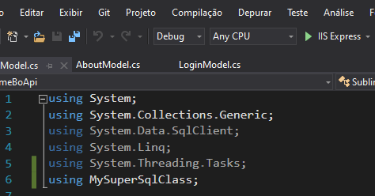
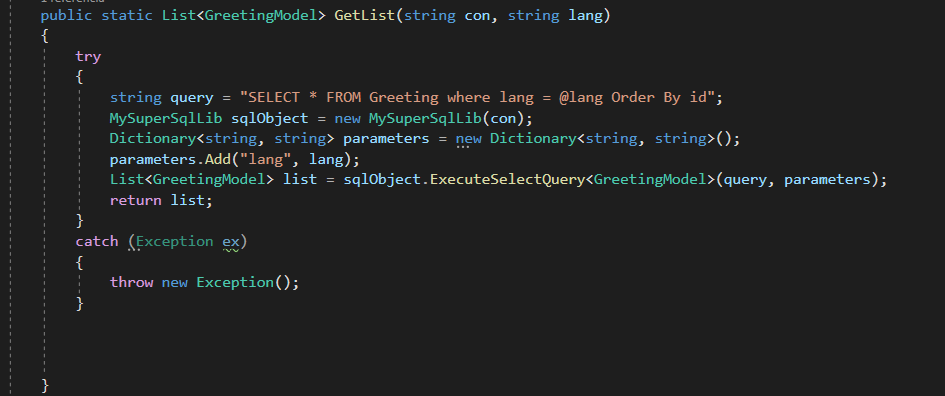
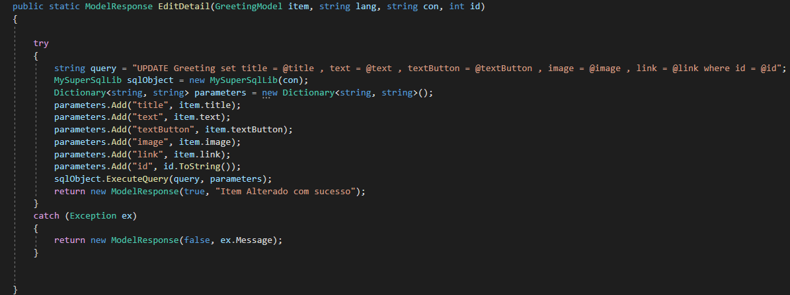
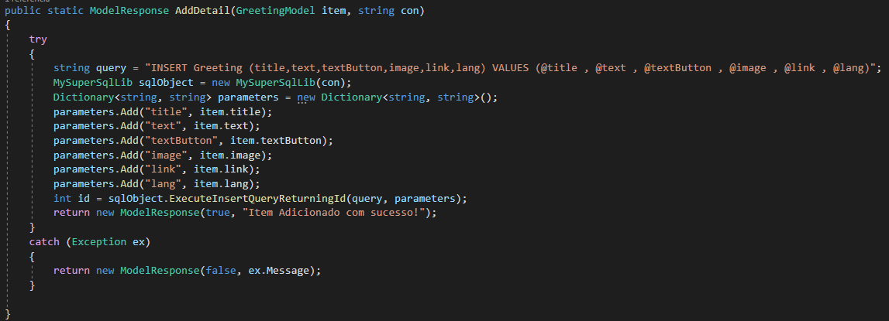
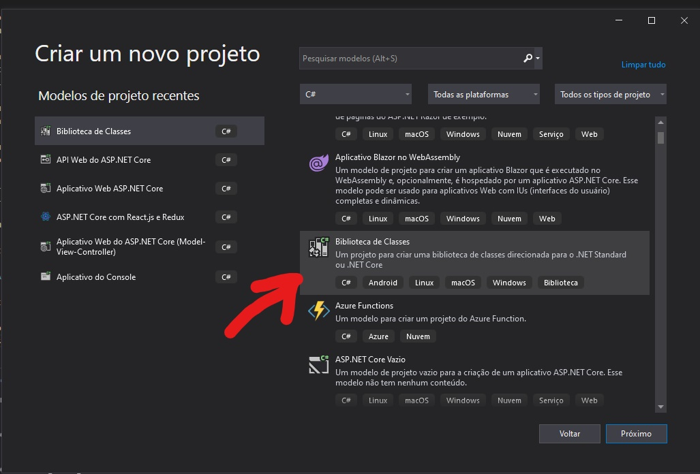

# MySuperSqlClass

## INTRODUCTION
------------

This is a small Library to connect to Sql server DataBase and execute querys.

## REQUIREMENTS
------------

This application requires the following:

```bash
Visual Studio 2019
Microsoft SQL SERVER
.Net core 3.1 Project
```
## Usage

```bash
First you must build the Library project to create the dll file to add as reference to the main project. 
Right click on the Library project name, and Build it.
```



```bash
After the dll is created , you have to add it to the main project , the project where you will use the library.
Right click on "references" and click on "Add reference" .
```


```bash
Then click on Search
```


```bash
Select the Dll and add it
```


```bash
Now , we are ready to use the library in our main project.
First we have to import the lib to the file where we are going to use it.
```


```bash
using MySuperSqlClass;
```

```bash
Now , we create the object to have access to the sql methods.
```
```bash
MySuperSqlLib sqlObject = new MySuperSqlLib(con);
where "con" is the connection string;
```
```bash
Methods:
 public List<T> ExecuteSelectQuery<T>(string query, Dictionary<string, string> parameters) where T : new()
 public void ExecuteQuery(string query, Dictionary<string, string> parameters)
 public int ExecuteInsertQueryReturningId(string query, Dictionary<string, string> parameters)
```
```bash
Example for public List<T> ExecuteSelectQuery<T>(string query, Dictionary<string, string> parameters) where T : new()

Params:
- string query
- Dictionary<string, string> parameters

Return:
- List<T>

Requiremts:
-needs to know the type of data (ExecuteSelectQuery<T> where T is the model/class and has to reflect the database table fields)

will work with: Select querys;
will not work with : Update, Delete , Insert querys;

Example:
```


```bash
Example for public void ExecuteQuery(string query, Dictionary<string, string> parameters)

Params:
- string query
- Dictionary<string, string> parameters

Return:
- void

Requiremts:
- none

will work with: Update, Delete , Insert querys; 
will not work with : Select querys;

Example:
```


```bash
Example for public int ExecuteInsertQueryReturningId(string query, Dictionary<string, string> parameters)

Params:
- string query
- Dictionary<string, string> parameters

Return:
- int id (id of the item that was added).

Requiremts:
- none

will work with: Insert querys; 
will not work with : Update, Delete , Select querys;

Example:
```


## Architecture



```bash
I used the selected template on the image above
```